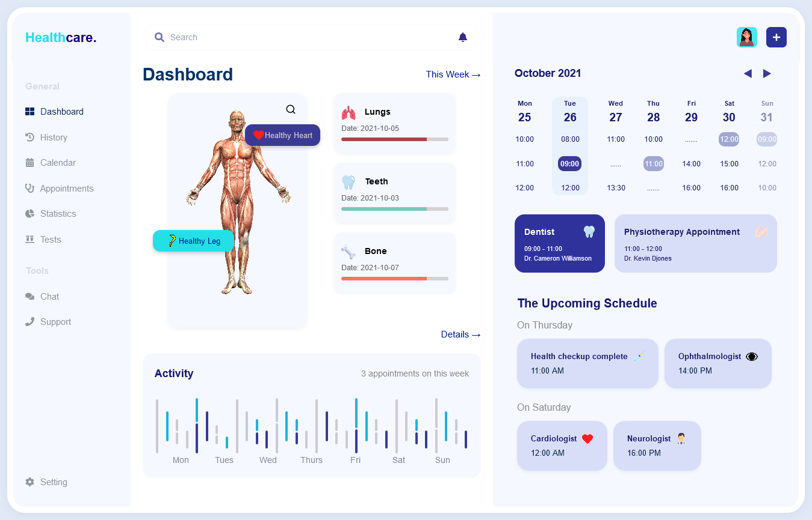

# Healthcare Dashboard UI (React)

 A fresh take on designing modern healthcare dashboards using React! This project is a front-end design attempt to recreate a pixel-perfect layout from a reference image — trying out new layouts, color schemes, and visual hierarchies to match real-world UI standards. It mainly focuses on:

- Responsive design
- Reusable components
- Flexbox & CSS Grid
- Static mock data

## 📸 Preview



## 🚀 Live Demo

👉 [Click here to view the live demo](https://fitpeo-healthcare.vercel.app/) 

## 🚀 Features

- Sidebar and Header layout
- Calendar view with appointment slots
- Upcoming schedule card
- Activity feed with multi-colored bar chart
- Health status cards
- Anatomy section
- responsive

## 🛠️ Tech Stack

- React
- CSS3 (Flexbox, Grid, Media Queries)
- Mock data (no backend)

## 📂 Project Structure
```text
📦 healthcare-dashboard-ui
├── 📁 public
│   └── preview.png
├── 📁 src
│   ├── 📁 assets     
│   ├── 📁 components
│   │   ├── 📁 Dashboard
│   │   │   ├── AnatomySection.jsx
│   │   │   ├── CalendarView.jsx
│   │   │   ├── HealthStatusCards.jsx
│   │   │   ├── UpcomingSchedule.jsx
│   │   │   ├── ActivityFeed.jsx
|   |   |   ├── SimpleAppoinmentCard.jsx
|   |   |   |__ DashboardMainContent
│   │   └── Sidebar.jsx
|   |   |__ Header.jsx
│   ├── 📁 data
│   │   |__ calenderData.js
|   |   |__ healthData.js
|   |   |__ appointments.js
|   |   |__ navigation.jsx
│   ├── 📁 styles
│   │   └── App.css
│   ├── App.js
│   ├── index.js
│   └── ...
├── .gitignore
├── README.md
├── package.json
└── vite.config.js
```


## 📦 Getting Started

1. Clone the repository:

```
git clone https://github.com/your-username/healthcare-dashboard.git
cd healthcare-dashboard
Install dependencies:
npm install
Run the app:
npm run dev

🙋‍♀️ Author
Gouri Nandhana
Frontend Developer | Full Stack Developer | Passionate about clean UI and UX

📄 License
This project is for demonstration purposes and not licensed for commercial use. Feel free to use the structure and ideas for your own learning.
